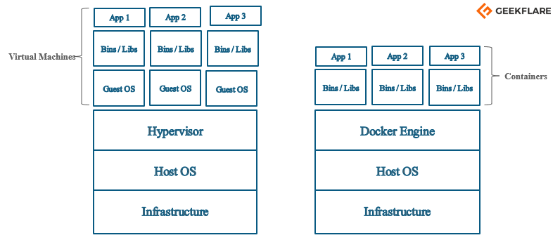

## Docker Basics

[Docker](https://www.docker.com/) is a tool for packing, shipping, and running applications within **containers**.

**Docker vs Virtual Machines:**



A Virtual machine is an emulation of real computer that executes programs.VM run on top of hypervisor,which is a host machine.

Whereas Docker consist of single host os instead of giving seperate guest os to each application.It loads faster than VMs.

### Terminology:

1)Container:Used to isolate an application and dependencies into a package that can run anywhere.After we run docker image ,it creates container.You can use docker api or cli to start,stop,delete the container.


2)Image:It is a template with instructions to create a docker container.Image can be pulled from a Docker hub.You can add additional instructions to the base image and create a new and modified docker image.

3)Dockerfile:It is a simple text file with a set of command.These commands are executed successively to perform actions on the base image to create a new docker image.


### Docker Engine:

It is layer on which Docker runs and is installed on host machine.It contains:

1)Docker daemon that runs in host computer

2)Docker client that then communicates with docker daemon to execute commands

3)REST API for interacting with docker daemon remotely


**Docker Hub**

It is the official repository where you could find all the Docker Images  

**Installation**

1. Uninstall the older version of docker if is already installed
```
$ sudo apt-get remove docker docker-engine docker.io containerd runc
```

2. Installing CE (Community Docker Engine)

```
$ sudo apt-get update
$ sudo apt-get install \
    apt-transport-https \
    ca-certificates \
    curl \
    gnupg-agent \
    software-properties-common
$ curl -fsSL https://download.docker.com/linux/ubuntu/gpg | sudo apt-key add -
$ sudo apt-key fingerprint 0EBFCD88
$ sudo add-apt-repository \
   "deb [arch=amd64] https://download.docker.com/linux/ubuntu \
   $(lsb_release -cs) \
   stable nightly test"
$ sudo apt-get update
$ sudo apt-get install docker-ce docker-ce-cli containerd.io

// Check if docker is successfully installed in your system
$ sudo docker run hello-world
```

[Refer](https://docs.docker.com/install/linux/docker-ce/ubuntu/)

**Commands**


* docker run – Runs a command in a new container.
* docker start – Starts one or more stopped containers
* docker stop – Stops one or more running containers
* docker build – Builds an image form a Docker file
* docker pull – Pulls an image or a repository from a registry
* docker push – Pushes an image or a repository to a registry
* docker export – Exports a container’s filesystem as a tar archive
* docker exec – Runs a command in a run-time container
* docker search – Searches the Docker Hub for images
* docker attach – Attaches to a running container
* docker commit – Creates a new image from a container’s changes

### Creating an Application

**Creating Dockerfile**
1)Start in fresh directory

2)Create a file name called Dockerfile and add following lines as we are using Python 3

```
FROM python:3
```
3)We want to run a python script "example.py" so add following in Dockerfile

```
ADD example.py/
```
4)Suppose we need "numpy" library for our application,we need to install it ,so add the following in Dockerfile

```
RUN pip install numpy
```
5)Add this line in Dockerfile to execute script

```
CMD["python","./example.py"]
```

So your Dockerfile would look like this:

```
FROM python:3
ADD example.py/
RUN pip install numpy
CMD["python","./example.py"]
```

Now you are ready to build an image from Dockerfile
```
docker build -t appname
```

**Run Your Image**
After your image has been built successfully, you can run it as a container. In your terminal, run the command
```
docker run appname
```

You can also find images on Dockerhub
